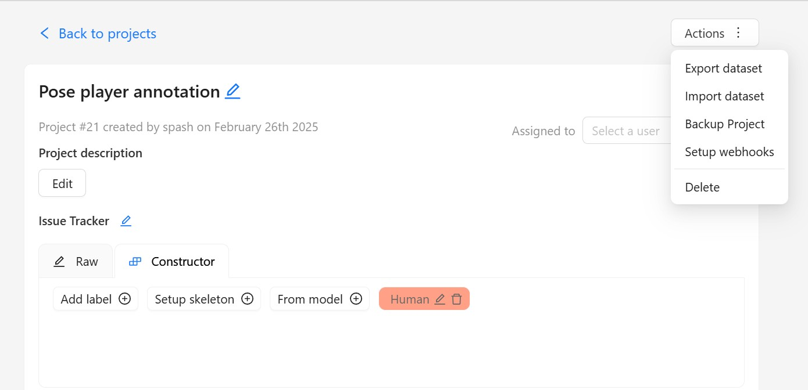
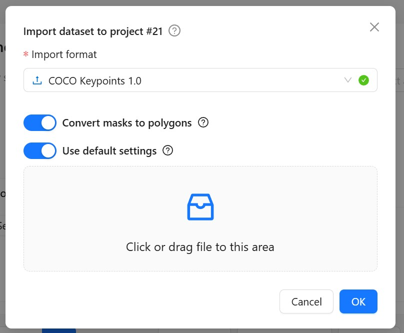
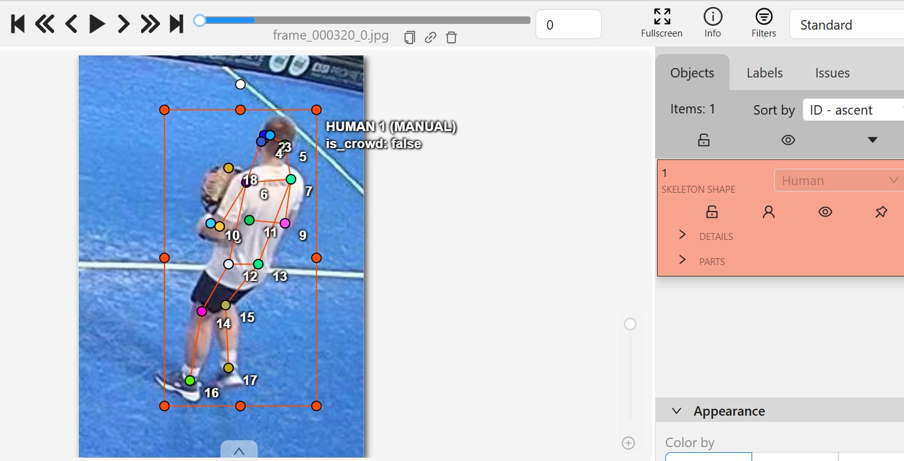
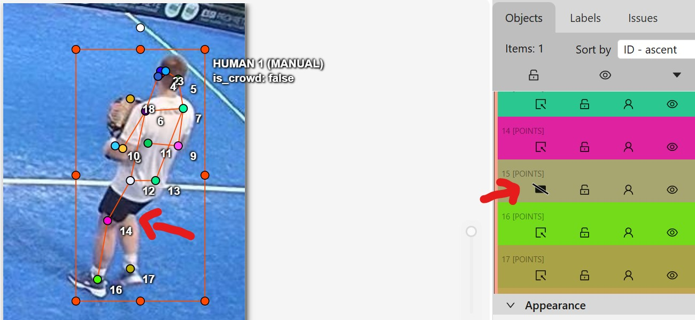

# Using CVAT for Pose Estimation Annotation

This short guide explains how to use **CVAT** (Computer Vision Annotation Tool) to annotate or correct pose estimation data.

## 1. Importing a Dataset into a Project

Import your dataset directly into a CVAT project.

- Go to your **Pose Player annotation** > **Actions** > **import dataset**




When uploading annotations (e.g. for correction), ensure your zip file follows the expected format:
- A zip folder containing your `annotations/person_keypoints_default.json` and `images/` .
- Select the annotation format COCO Keypoints.

Example:

```
.zip
├── images/              
│   ├── image_1.jpg    
│   ├── image_2.jpg    
│   └── ...      
└── annotations/    
    └── person_keypoints_default.json  
```



## 3. Global Use: Adjusting Keypoints on CVAT

Once a pose is detected or loaded, you can easily correct it:
- **Drag & drop** keypoints to adjust their position
- **Hover** over a keypoint to change its label or properties.

Useful shortcuts for faster annotation:
- `f` → go **forward** to the next frame
- `d` → go **backward** to the previous frame
- `o` → mark a keypoint as **outside** (makes it disappear and ignored during training)
- `Ctrl + S` → **save** the current annotations
- `Ctrl + Z` → **undo** the last action
- `n` → **recreate a skeleton** if it's missing or deleted



## 4. Marking Keypoints as ‘Outside’

If a keypoint should be **ignored** by the model (e.g. occluded or out-of-frame), mark it as **`outside`**:

- **Hover** over the keypoint to change and **tap** `o`.
- Once marked, the keypoint will **disappear visually**, and will be excluded from training



## 5. Export a Dataset Locally

Once your annotations are complete or corrected, you can export the dataset from CVAT:

- Put the tasks you want to use in different subset (train, val or test).
- Go to your **Task** > **Actions** > **Export Task Dataset**
- Choose the format: **COCO Keypoints 1.0**
- Click **Export** and download the generated zip file

The exported `.zip` file will follow this structure:

```
.zip
├── images/
│   ├── Train/
│   └── Validation/
└── annotations/
    ├── person_keypoints_Train.json
    └── person_keypoints_Validation.json
```

But the code works with different folder names, so for simplicity rename the different folders to follow this structure: 

```
.zip
├── images/
│   ├── train/
│   └── val/
└── annotations/
    ├── person_keypoints_train.json
    └── person_keypoints_val.json
```

Then you're good to go.